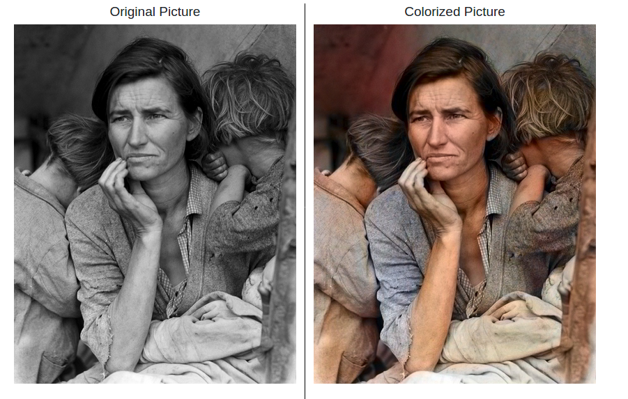
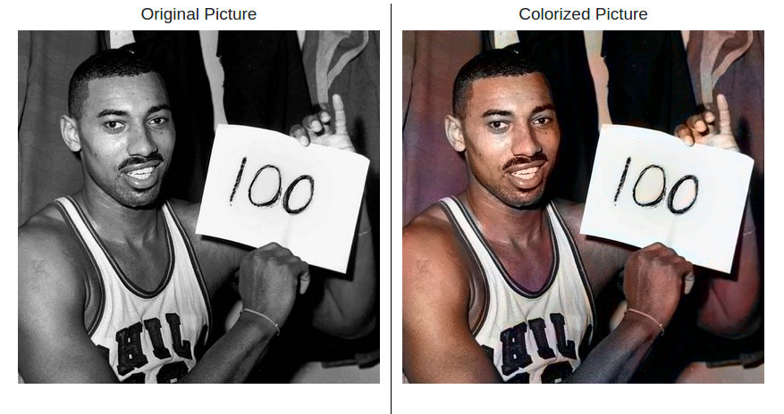

# chromaGAN-colorizer-using-flask

This is a basic Flask application to colorize pictures using ChromaGAN.


Casablanca, 1942

## Requirements

Requirements could be found in requirements.txt, to install them:

```bash
pip install -r requirements.txt
```

In case you don't want to install them all, there are key libraries to be installed:

keras==2.2.4, tensorflow==1.11.0, Flask==1.1.2

#### PS: You need to download the pretrained model in order to use application, thus it could be found [here](https://drive.google.com/drive/folders/12s4rbLmnjW4e8MmESbfRStGbrjOrahlW).

## Usage

Download the pretrained model from link above then replace it with `dummyFile` under `MODEL` directory.

Besides, in the first use it is required to download the `VGG16` to colorize the pictures. It will be downloaded automatically once you run it.

Within the chromaGAN-colorizer-using-Flask directory, run:

```bash
EXPORT FLASK_APP=run.py
flask run
```

Then open link `127.0.0.1:5000` in the browser.

## More examples


Marilyn Monroe



Migrant Mother, 1936



Wilt Chamberlain, 1962

#### This project is based on:
- [ChromaGAN: Adversarial Picture Colorization with Semantic Class Distribution](https://arxiv.org/pdf/1907.09837.pdf)
- [Official implementation of ChromaGAN](https://github.com/pvitoria/ChromaGAN)


## License
[MIT](https://choosealicense.com/licenses/mit/)
